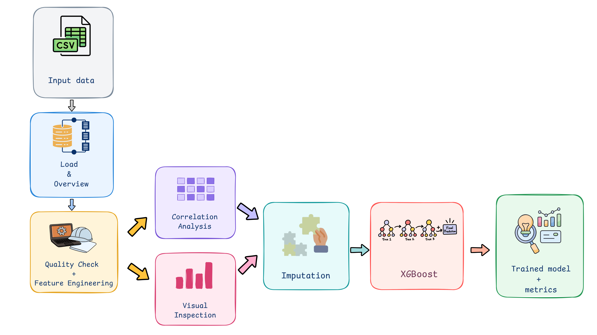
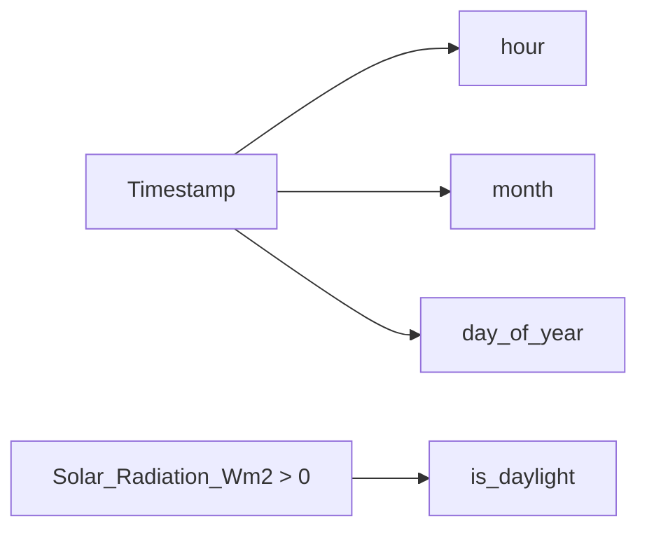
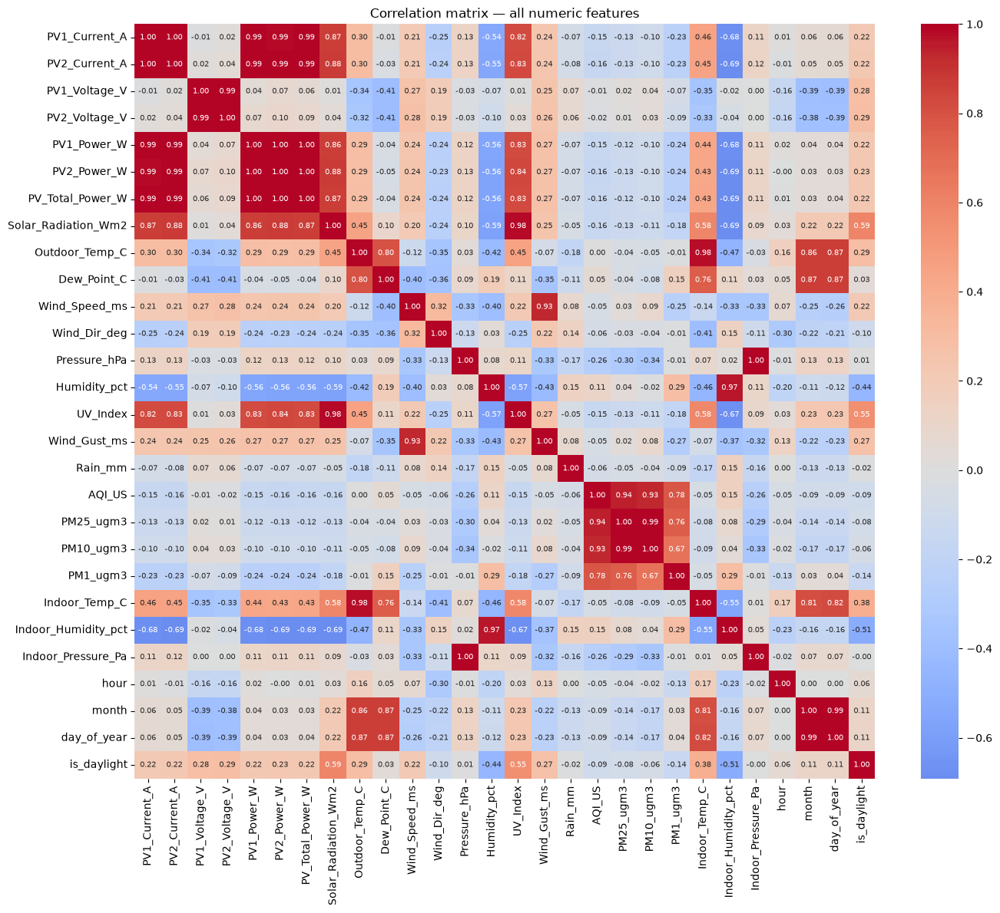
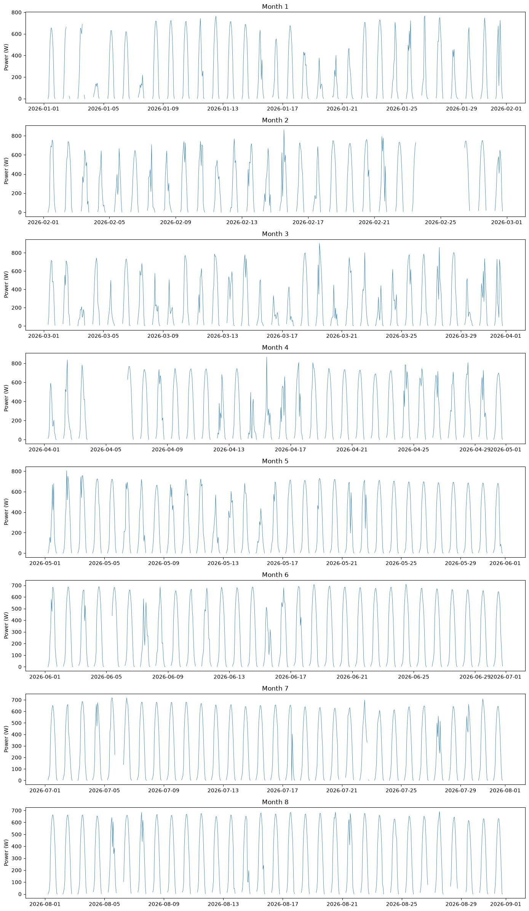
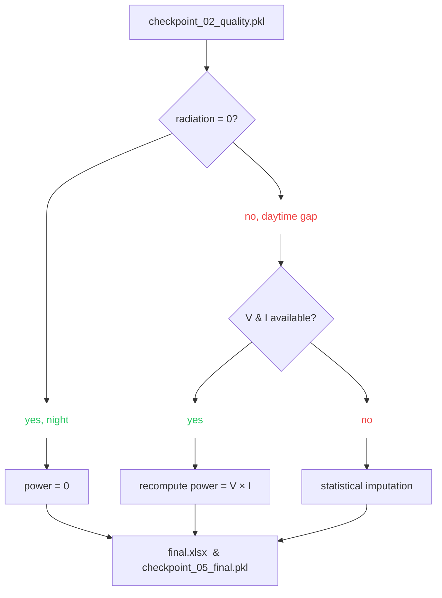
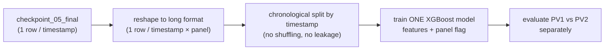
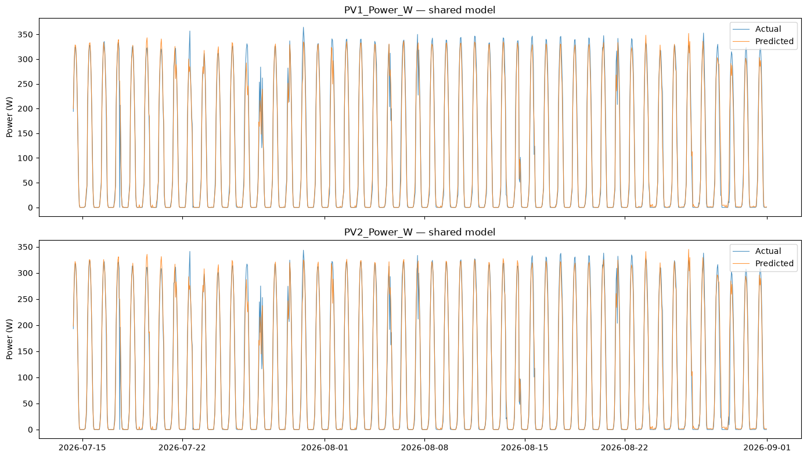

# ☀️ Solar Plant Power Forecasting — Machine Learning Model

Forecasting **hourly PV power output** (`PV1_Power_W` and `PV2_Power_W`) of two rooftop solar panels from weather data, end-to-end: raw monthly exports → quality checks → feature engineering → correlation → imputation → **XGBoost**.


> Companion repo to the [statistical AR model](../TimeSeriesForcasting) — same problem family (PV forecasting), different plant, different approach: **machine learning** instead of a classical time-series model.

---

## 🧭 Pipeline at a glance



Notebooks 3 and 4 both branch off notebook 2's checkpoint and don't depend on each other — they're analysis-only (no output file). Everything else is a straight line: **run 1 → 2 → 5 → 6**, with 3 and 4 read whenever you like in between.

| # | Notebook | Input | Output |
|---|----------|-------|--------|
| 1 | `01_data_loading_overview.ipynb` | `Input/merged_2026-*.csv` | `Output/checkpoint_01_loaded.pkl` |
| 2 | `02_data_quality_feature_engineering.ipynb` | `checkpoint_01_loaded.pkl` | `Output/checkpoint_02_quality.pkl` |
| 3 | `03_correlation_analysis.ipynb` | `checkpoint_02_quality.pkl` | — (analysis only) |
| 4 | `04_visual_inspection.ipynb` | `checkpoint_02_quality.pkl` | — (analysis only) |
| 5 | `05_data_preparation_imputation.ipynb` | `checkpoint_02_quality.pkl` | `Output/checkpoint_05_final.pkl` |
| 6 | `06_Model_Training_and_Evaluation(single_model).ipynb` | `checkpoint_05_final.pkl` | trained model + metrics |

> ⚠️ `Input/` and `Output/` are gitignored (raw data + generated checkpoints). Drop your own `merged_2026-*.csv` files into `Input/` before running notebook 1.

---

## 1️⃣ Load & Overview — *many files → one timeline*

- Reads every `Input/merged_2026-*.csv` (one file per month)
- Concatenates and sorts by `Timestamp` into a single hourly DataFrame
- First look: shape, dtypes, `.describe()`

Just a handoff step — nothing is cleaned yet.

---

## 2️⃣ Quality Check + Feature Engineering — *know your data, then shape it*

**Quality check:**
- `PV1/PV2_Power_W` are `NaN` at night — expected, not a defect. What matters is missingness **during daylight hours**
- Sanity-checks the electrical readings before trusting them

**Feature engineering** — derives the time signals every later step relies on:



---

## 3️⃣ Correlation Analysis — *what actually predicts power?*

Heatmap over every numeric column, read for two things: **what drives power**, and **what's redundant**.



| Finding | Why it matters |
|---|---|
| `Solar_Radiation_Wm2` ↔ power: **~0.86–0.88** | strongest driver — expected |
| `UV_Index` ↔ `Solar_Radiation_Wm2`: **0.98** | same signal twice → drop one |
| `Humidity_pct` ↔ power: **-0.54 to -0.59** | humid air scatters/absorbs sunlight |
| Indoor vs. outdoor temp/humidity: highly correlated | indoor sensors are redundant |
| `AQI_US` / `PM10` / `PM25`, and `Wind_Speed` / `Wind_Gust` | each pair redundant, keep one |
| `Pressure_hPa` ↔ `Indoor_Pressure_Pa`: **1.00** | literally duplicated |
| Voltage ↔ current/power | barely correlates — surprising, worth a note |

**Result:** this notebook is what decides which columns notebook 6 excludes as redundant.

---

## 4️⃣ Visual Inspection — *see the gaps before you fill them*

Plots power over time, by month, and against irradiance — purely to catch problems a summary statistic would hide.

**By month** — this is where the outages actually jump out:



**Takeaways:**
- Some days (months 2 and 4) show **no peak at all** — not clouds, not night: the **sensor/logger was down** for multiple consecutive days
- Other months have scattered daytime gaps — smaller, more typical missingness

This distinction (multi-day outage vs. scattered gaps) is exactly what shapes the imputation strategy next.

---

## 5️⃣ Imputation — *fill what's missing, the right way for each case*



Domain knowledge first (physics: no sun → zero power; power = voltage × current), statistics only for what's left.

---

## 6️⃣ Model Training — one shared XGBoost model for both panels



**Why one shared model instead of two?** PV1 and PV2 see the same weather and are ~0.99 correlated. Reshaping so each timestamp appears twice (once per panel, with a `panel` flag) lets the model pool *all* the data instead of halving it — useful with only ~5,800 hourly rows — while `panel` still lets it express the small PV1-vs-PV2 gap.

**Features used (14):** `Solar_Radiation_Wm2`, `Outdoor_Temp_C`, `Dew_Point_C`, `Wind_Speed_ms`, `Wind_Dir_deg`, `Pressure_hPa`, `Humidity_pct`, `Rain_mm`, `PM25_ugm3`, `hour` *(cyclically encoded)*, `month`, `day_of_year` *(cyclically encoded)*, `is_daylight`, `panel`.

🚫 **Deliberately excluded:** current, voltage, the other panel's power — these are outputs measured at the same instant as power itself, not things you'd know in advance.

**Split:** chronological, held-out on the most recent ~20% of the timeline (not random — adjacent hours are correlated).

**Accuracy (daylight hours, on unseen recent data):**

| Panel | MAE | RMSE | R² |
|---|---|---|---|
| PV1 | 14.4 W | 24.6 W | 0.964 |
| PV2 | 12.2 W | 22.4 W | 0.966 |

**Predicted vs. actual**, both panels, on the held-out period:



PV1 consistently scores a bit worse than PV2 — checked in the notebook's residuals section as a possible physical signal (shading, soiling, orientation) rather than a modeling artifact.

---

## 🗂️ Repo structure

```
FssDataForecasting/
├── notebooks/
│   ├── 01_data_loading_overview.ipynb
│   ├── 02_data_quality_feature_engineering.ipynb
│   ├── 03_correlation_analysis.ipynb
│   ├── 04_visual_inspection.ipynb
│   ├── 05_data_preparation_imputation.ipynb
│   ├── 06_Model_Training_and_Evaluation.ipynb            # PV1 & PV2 trained separately
│   └── 06_Model_Training_and_Evaluation(single_model).ipynb  # shared model (used for models/)
├── models/
│   └── xgb_shared_model.joblib   # trained shared model, tracked in git
├── Input/                         # ⚠️ not included — add merged_2026-*.csv here
├── Output/                        # ⚠️ gitignored — checkpoints generated by the notebooks
├── pyproject.toml / uv.lock       # deps, managed with uv
└── requirements.txt
```

---

## 🚀 Getting started

```bash
# using uv (recommended — matches pyproject.toml / uv.lock)
uv sync

# or plain pip
pip install -r requirements.txt
```

Then:
1. Place your `merged_2026-*.csv` files in `Input/`
2. Run the notebooks **in order**, 1 → 2 → (3, 4 optional) → 5 → 6

**Requires:** Python 3.13+ · pandas · numpy · scikit-learn · xgboost · matplotlib · seaborn · openpyxl

---

## Using the trained model

```python
import joblib
import pandas as pd

model = joblib.load("models/xgb_shared_model.joblib")
feature_cols = joblib.load("Output/feature_cols_shared.joblib")  # regenerated by notebook 6

# panel=0 for PV1, panel=1 for PV2 — same weather features either way
row = pd.DataFrame([{
    "Solar_Radiation_Wm2": 600, "Outdoor_Temp_C": 28, "Dew_Point_C": 15,
    "Wind_Speed_ms": 2.0, "Wind_Dir_deg": 180, "Pressure_hPa": 1015,
    "Humidity_pct": 45, "Rain_mm": 0, "PM25_ugm3": 12,
    "month": 7, "is_daylight": 1,
    "hour_sin": 0.5, "hour_cos": 0.87, "doy_sin": -0.3, "doy_cos": 0.95,
    "panel": 0,
}])[feature_cols]

predicted_power_w = model.predict(row)
```

---

## 📌 Known limitations

- Only **8 months** of data (Jan–Aug) — no autumn/winter yet, so accuracy may drop on unseen seasons
- **PV1 consistently predicts slightly worse than PV2** across every model tried — likely a real physical difference (shading, soiling, orientation), worth checking on the hardware side
- Trained on **one specific 2-panel installation** — not yet validated on other sites/panel setups

**Next steps:** hyperparameter tuning via `GridSearchCV` / `RandomizedSearchCV` with a `TimeSeriesSplit` cross-validator (not a regular k-fold), and re-evaluating once more months of data cover the missing seasons.